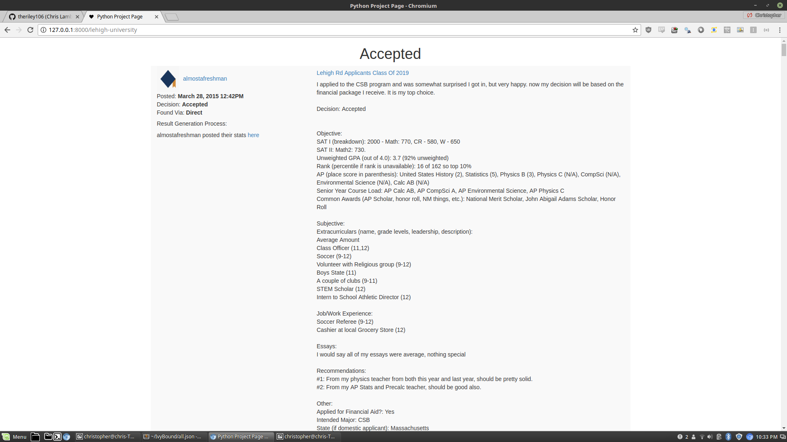

<p align="center">
  
<h5 align="center">Aggregating College Confidential "Stats" comments to determine your likelihood of getting into competitive colleges</h5>
</p>


### What does this do?

College Confidential is argueably the largest forum dedicated to the college admission process.

On many of the CC threads dedicated to specific university applications, students will post their application stats along with their application results.  This allows future applicants to properly guage their chance of getting into a specific university, and this information can be far more valuable than the numbers listed in a College's Common Data Set.

Unfortunately, these stats posts can be relatively hard to find as some University threads have 1000's of comments with multiple years worth of information.

This program agregates College Confidential comments containing application stats, and organizes them based on the University name.

### How do I use this?

Go to any college confidential forum, and replace the URL like so:

```bash
https://talk.collegeconfidential.com/massachusetts-institute-technology/
```

to

```bash
localhost:8000/massachusetts-institute-technology/
```

### How can I specify admission type?  (Freshman, Transfer, etc.)

Adding a "type" parameter to the URL allows you to specify admission type.  For instance:

```bash
localhost:8000/carnegie-mellon-university?type=transfer
```
or

```bash
localhost:8000/carnegie-mellon-university?type=freshman
```

Additionally, you can specify filters based on school type as well:

```bash
localhost:8000/university-california-berkeley?type=haas
```

### Example

<p align="center">
  
</p>


