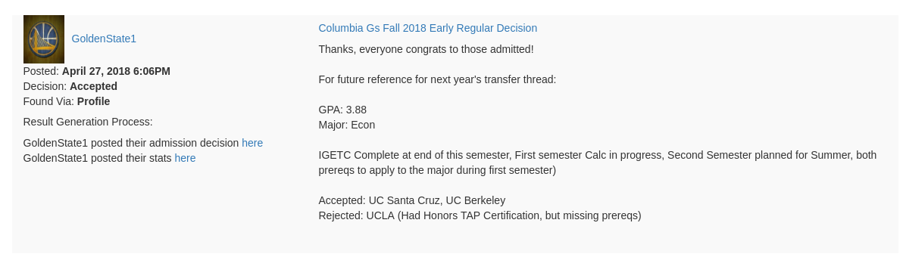

<p align="center">
  
<h5 align="center">Aggregating College Confidential "Stats" comments to determine your likelihood of getting into competitive colleges</h5>
</p>


## What does this do?

College Confidential is arguably the largest forum dedicated to the college admission process.

On many of the CC threads dedicated to specific university applications, students will post their application stats along with their application results.  This allows future applicants to properly gauge their chance of getting into a specific university, and this information can be far more valuable than the numbers listed in a College's Common Data Set.

Unfortunately, these stats posts can be relatively hard to find as some university threads have 1000's of comments with multiple years worth of information.  Additionally, students will commonly post admission results without their stats, which requires future applicants to try to find where they may have been posted elsewhere (a chance me thread, another university forum, etc.).

This program aggregates College Confidential comments containing application stats and crawls College Confidential to find stats from users that post admission results.  This program organizes them based on the University name.

## How do I use this?

Install all requirements with the following command:

```bash
$ pip install -r requirements.txt
```

Start the Flask server with the following command:

```bash
$ python app.py
```

Go to any college confidential forum, and replace the URL like so:

```bash
https://talk.collegeconfidential.com/massachusetts-institute-technology/
```

to

```bash
localhost:8000/massachusetts-institute-technology/
```

## How can I specify admission type?  (Freshman, Transfer, etc.)

Adding a "type" parameter to the URL allows you to specify admission type.  For instance:

```bash
localhost:8000/carnegie-mellon-university?type=transfer
```
or

```bash
localhost:8000/carnegie-mellon-university?type=freshman
```

Additionally, you can specify filters based on school type as well:

```bash
localhost:8000/university-california-berkeley?type=haas
```

## Result Generation Process

The program records the process of getting admission stats so that the user can confirm the accuracy.

In the following result, you can see the process used to get this admission result:

<p align="center">
  
</p>

In other words, GoldenState1 posted that they received an acceptance in the Columbia University admissions thread, but they posted their stats in a seperate admissions thread for a different school.

## Why is it taking so long to pull admission statistics?

Many applicants will post their admission result without including stats, so this program crawls through each poster's college confidential account to find stats that they've posted in other threads.

It turns out that doing this is *extremely* computationally intensive.  For instance, pulling every Yale University admission statistic requires searching through 5,092 threads across 122 College Confidential forums.

Even with multiple threads pulling admission stats simultaneously, this still takes a *really* long time - especially if you have a slow internet connection.

## Example Results

<p align="center">
  
</p>

<p align="center">
  
</p>


<p align="center">
  
</p>


<p align="center">
  
</p>


